# **Powdery Mildew Detector**


[**Live Website**](https://ml-powdery-mildew-detector-d12411e2b28f.herokuapp.com/)

Powdery Mildew Detector is a data science and machine learning project.  
The business goal of this project is to detect a biothrophic fungus infection called [Powdery Mildew](https://treefruit.wsu.edu/crop-protection/disease-management/cherry-powdery-mildew/#:~:text=Powdery%20mildew%20of%20sweet%20and,1) in cherry leaves by utilizing a convulutional neural network (CNN) trained on images sourced from [Kaggle](https://www.kaggle.com/datasets/codeinstitute/cherry-leaves).

## **Table of Contents**

1. [Dataset Contents](#dataset-contents)
2. [Business Requirements](#business-requirements)
3. [Hypothesis and Validation](#hypothesis-and-validation)
4. [The ML Model](#the-ml-model)
5. [Implementation of the Business Requirements](#implementation-of-the-business-requirements)
6. [Dashboard Design](#dashboard-design)
7. [Bugs and Errors](#bugs-and-errors)
8. [Deployment](#deployment)
9. [Technologies](#technologies)
10. [Credits](#credits)

## **Dataset Contents**

The Dataset [cherry_leaves on Kaggle](https://www.kaggle.com/datasets/codeinstitute/cherry-leaves) provided by [Code Institute](https://codeinstitute.net/global) has been used in this project.

The dataset features 4208 photographs of cherry leaves and the images are already split 50/50 into healthy and powdery mildew infected cherry leaves. Each images shows a single leaf either infected or uninfected against a neutral background and consistent lightning.  

[Back to top ⇧](#table-of-contents)

## **Business Requirements**

The primary objective of this project is to develop a machine learning model for the accurate detection of powdery mildew in cherry leaves. The model is intended to offer the client a reliable and fast way to detect and diagnose infected leaves. The client can effectively trace them back to their respective trees and take necessary measures, such as applying fungicides, to prevent the spread of the fungus.

Summary:
+ The client is interested in conducting a study to visually differentiate a cherry leaf that is healthy from one that contains powdery mildew.
+ The client is interested in predicting if a cherry leaf is healthy or contains powdery mildew.
+ The client needs a dashboard.
+ The client wants a minimum prediction accuracy of 97%.


[Back to top ⇧](#table-of-contents)

## **Hypothesis and Validation**

### **Hypothesis**  

> Infected leaves are visually different from healthy ones.

### **Validation**

To validate the hypothesis, an image study must be conducted. The machine learning model must be trained to recognize these differences and reliably predict an infected from a healthy leaf.

> Healthy cherry leaves are characterized by their rich, dark green color, which often appear vibrant and glossy.

> Powdery mildew on cherry leaves typically appears as a white to grayish powdery growth on the surface of infected plant tissues.

### **Understanding the Problem**

Feeding an image dataset into a neural network model requires the images to be prepared before the model training starts. It is important to normalize the images, normalizing refers to the process of adjusting the pixel values of an image so they fall within a specific range.

+ This is done to make the image data more consistent an suitable for processing by machine learning models. 
+ Normalizing helps mitigating the effects of variations in lightning conditions, contrast and color distribution across the images in the dataset.

To complete this task, we need to calculate the mean and standard deviation of the dataset.

The mathematical formula takes the following dimensions of the images:

+ **H** is the height of an image, in our case in pixel (px)
+ **W** is the widht of an image, in our case in pixel (px)
+ **C** is the number of channel, in our case 3 für RGB images
+ **B** is the batch size, in our case 20 images per batch

The visual output for the mean image looks like this:

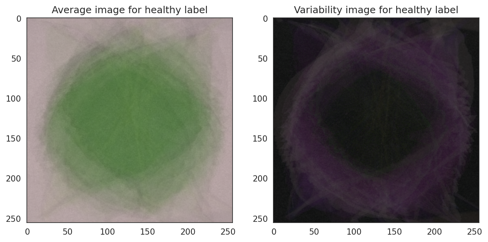
We notice the healthy leaves have a clear green center and more defined edges.


The infected leaves show more white stripes in the center and and appear less distinct.


The most obvious pattern where we could differentiate the average images from one another is the center part.

[Back to top ⇧](#table-of-contents)

## **The ML Model**

The ML model is a convolutional neural network (CNN) build with keras, a neural network API. This model is designed for a binary classification task.

### The Models Architecture

1. Sequential Model
    +  Sequential in a machine learning context with frameworks like TensorFlow or Keras refers to a linear stack of layers. It indicates that layers are added one after another. 

2. Input Layer (1x)
    + The initial layer of a neural network that receives the input data and passes it onto the next subsequent layer for processing. It serves as an entry point for data.

3. Convolutional Layer (3x)
    + The core operations of a convolutional layer is the convolution operation, which involves applying a filter (also knows as a kernel) to the input image. This filter moves across the input image, computing the dot product and the input pixels. This results in a feature map which highlights certain patterns in the input image.
    
4. Fully Connected Layer (1x)   
    + Also known as *Dense Layer* is a type of neural network layer where each neuron in the layer is connected to every neuron in the preceding layer. 

5. Output Layer (1x)
    + The output is the final layer in a neural network. Its primary function is to produce the output for a given input after the data was processed through the preceding layers
    
### The Models Hyperparameters

1. Conv2D
    + Conv2D stands for *2D Convolutional Layer*.
    + It is used to process 2-dimensional data such as images.
    + The layer performs convolutional operations by applying a filter to the image, extracting features from the image.
    + Parameters:
        + filters: number of filters to apply
        + Kernel_size: size of the filter, typically as a tuple (height, width)
        + activation: function applied to the output of the layer

2. MaxPooling2D
    + MaxPooling2d is a downsampling operation used in convolutional neural networks to reduce the spatial dimensions of the feature maps while saving the most important information.
    + It divides the input feature into non-overlapping rectangular regions and outputs the maximum value within each region.
    + It helps in reducing complexity and overfitting by reducing the number of parameters in the neural network.

3. Flatten
    + The Flatten Layer works as a connector between the convolutional layers and the fully connected layer.
    + It transforms multi-dimensional output into an one-dimensional array.
    + This is necessary because fully connected layers require their input to be one-dimensional.

4. Dropout
    + The Dropout Layer is a regulation technique used to prevent overfitting by randomly dropping out a proportion of input neurons during training.
    + Dropping out neurons during training intoduces noise and helps to prevent overfitting.

5. Activation
    + Activation function are mathematical operations applied to the output of each neuron.
    + They introduce non-linearity into the network, therefore enabling to learn complex patterns in the data.
    + ReLU Activation
        + ReLU is a simple thresholding operation to the input.
        + Any input less than zero is set to zero.
        + Any positive input remains unchanged.
    + Sigmoid Activation
        + Sigmoid is a commonly used activation function for binary classifications.
        + The function takes any valued number and squashed it into the range from 0 to 1.
        + If the data is positive it is classifies as 1, if negative as 0.

6. Optimizer
    + An optimizer in machine learning is an algorithm used to adjust the parameters of a model.
    + The goal of optimization is to find the set of parameters that result in the best performance.
    + Adam optimizer
        + The Adam optimizer combines momentum and adaptive learning rates to improve speed and robustness during training.

### The Model Training

For the model training, an *EarlyStopping* callback was implemented. That means, that the training of the model would automatically stop, when a specifies metric stops improving. The monitored metric was *val_accuracy* with the *patience* ste to *3*.

#### **Version v1**

<details>
<summary>This is the model used for version 1</summary>

    model = Sequential()

    # Input Layer
    model.add(Conv2D(filters=4,
                     kernel_size=(3, 3),
                     input_shape=image_shape,
                     activation='relu'))
    model.add(MaxPooling2D(pool_size=(2, 2)))

    # Convolutional Layers
    model.add(Conv2D(filters=8,
                     kernel_size=(3, 3),
                     activation='relu'))
    model.add(MaxPooling2D(pool_size=(2, 2)))

    model.add(Conv2D(filters=16,
                     kernel_size=(3, 3),
                     activation='relu'))
    model.add(MaxPooling2D(pool_size=(2, 2)))

    model.add(Flatten())

    # Fully Connected Layer
    model.add(Dense(16, activation='relu'))

    model.add(Dropout(0.2))

    # Output Layer
    model.add(Dense(1, activation='sigmoid'))

    model.compile(loss='binary_crossentropy',
                  optimizer='adam',
                  metrics=['accuracy'])

    return model

</details>

<details>
<summary>These are the results from model training v1</summary>


</details>

#### **Version v2**

<details>
<summary>This is the model used for version 2</summary>

    model = Sequential()

    # Input Layer
    model.add(Conv2D(filters=8,
                     kernel_size=(3, 3),
                     input_shape=image_shape,
                     activation='relu'))
    model.add(MaxPooling2D(pool_size=(2, 2)))

    # Convolutional Layers
    model.add(Conv2D(filters=16,
                     kernel_size=(3, 3),
                     activation='relu'))
    model.add(MaxPooling2D(pool_size=(2, 2)))

    model.add(Conv2D(filters=32,
                     kernel_size=(3, 3),
                     activation='relu'))
    model.add(MaxPooling2D(pool_size=(2, 2)))

    model.add(Flatten())

    # Fully Connected Layer
    model.add(Dense(32, activation='relu'))

    model.add(Dropout(0.2))

    # Output Layer
    model.add(Dense(1, activation='sigmoid'))

    model.compile(loss='binary_crossentropy',
                  optimizer='adam',
                  metrics=['accuracy'])

    return model

</details>

<details>
<summary>These are the results from model training v2</summary>


</details>

#### **Version v3**

<details>
<summary>This is the model used for version 3</summary>

    model = Sequential()

    # Input Layer
    model.add(Conv2D(filters=16,
                     kernel_size=(3, 3),
                     input_shape=image_shape,
                     activation='relu'))
    model.add(MaxPooling2D(pool_size=(2, 2)))

    # Convolutional Layers
    model.add(Conv2D(filters=32,
                     kernel_size=(3, 3),
                     activation='relu'))
    model.add(MaxPooling2D(pool_size=(2, 2)))

    model.add(Conv2D(filters=64,
                     kernel_size=(3, 3),
                     activation='relu'))
    model.add(MaxPooling2D(pool_size=(2, 2)))

    model.add(Flatten())

    # Fully Connected Layer
    model.add(Dense(64, activation='relu'))

    model.add(Dropout(0.2))

    # Output Layer
    model.add(Dense(1, activation='sigmoid'))

    model.compile(loss='binary_crossentropy',
                  optimizer='adam',
                  metrics=['accuracy'])

    return model

</details>

<details>
<summary>These are the results from model training v3</summary>


</details>

### **Model Training Conclusion**

In machine learning and convolutional networks, there is no one-size-fits-all approach. Optimal parameter selection often involves a process of trial and error.

**Version 1**

Starting out with version 1, a relatively *small* model was chosen to test the waters. Version 1 surprised with a relatively stable and reliable training. The accuracy metric initially started very high an continued to improve steadily. As the loss started at around 0.4 but also continued to improve to lower values. 
It was decided to double the filter size for the next version.

**Version 2**

Version 2 showed stronger accuracy and loss metrics than version 1. But when evaluation the result with a confusion matrix it showed a larg than expected FN value in predicted powdery mildew. It was decided to increase the filter size once again as well as the Dense layer size.

**Version 3**

Version 3 showed the highest accuracy and lowest loss values from all versions. The confusion matrix had notably high TP and TN values, which indicates very promising outcome. 

While the crossing of the val_accuracy and accuracy lines suggested potential instability and overfitting in the model, the magnitude of this effect was deemed relatively insignificant in the context of the overall model performance.

It was decided to use this model version for further evaluation and testing on real and unfamiliar data.

[Back to top ⇧](#table-of-contents)

## **Implementation of the Business Requirements**

For better understanding and effective implementation of the buisness requirements, they were split into smaller user stories.

### **Business Requirement 1**
> The client is interested in conducting a study to visually differentiate a cherry leaf that is healthy from one that contains powdery mildew.

**User Story**
+ As the client I want to display the difference between a healthy and a powdery mildew infected leaf. 
+ As the client I want to display the mean and standard deviation images for healthy and powdery mildew infected cherry leaves.

**Fulfillment**
+ An image montage for healthy and infected leaves was implemented in the dashboard.
+ Mean and standard deviation images for both healthy and powdery mildew infected leaves was implemented in the dashboard.
+ The difference between average healthy and average infected leaves was implemented in the dashboard. 

### **Business Requirement 2**
> The client is interested in predicting if a cherry leaf is healthy or is infected with powdery mildew.

**User Story**
+ As the client I want a machine learning model to predict whether a leaf is healthy or infected with powdery mildew.

**Fulfillment**
+ The client can upload a picture of a cherry leaf to the dashboard to instantly get an evaluation.
+ The client can upload multiple pictured at once, up to 200mb.
+ The client can download a Report for the prediction.

### **Business Requirement 3**
> The client needs a dashboard.

**User Story**
+ As the client I want to easily navigate an interactive dashboard so that I can seemlessly work with my data.

**Fulfillment**
+ An interactive streamlit dashboard was created and released on a web-based platform. [Dashboard Design](#dashboard-design)

### **Business Requirement 4**
> The client wants a minimum prediction accuracy of 97%.

**User Story**
+ As the client I want the machine learning model to be as accurate as possible!

**Fulfillment**
+ The model reached an accuracy of 99.76%


[Back to top ⇧](#table-of-contents)

## **Dashboard Design**

### Sidebar

A visible sidebar is present on the entire page, providing convenient navigation. Is part of business requirement 3.

<details>
<summary>Click Me to see the Sidebar</summary>

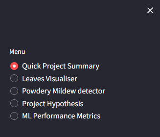

</details>

### Page 1 - Project Summary

The front page offers a summary of the project's business premise and general information.

<details>
<summary>Click Me to see the Project Summary Page</summary>

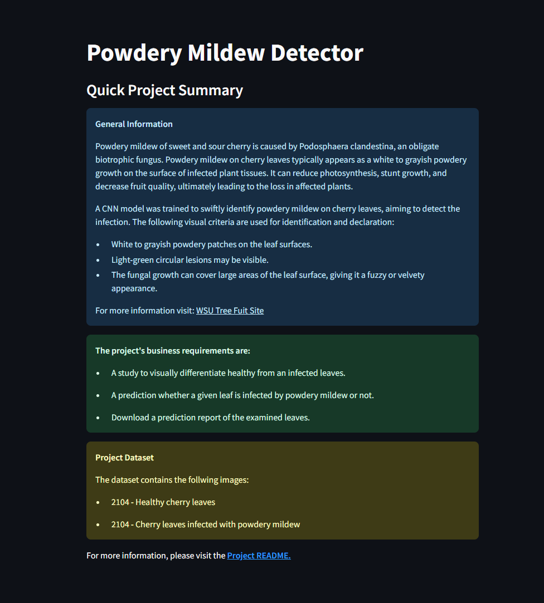

</details>

### Page 2 - Leaves Visualizer

Completing the first business requirement, this page provides visualizations of mean and standard deviation, along with image montages showcasing both healthy and powdery mildew infected images.

<details>
<summary>Click Me to see the Leaves Visualizer Page</summary>

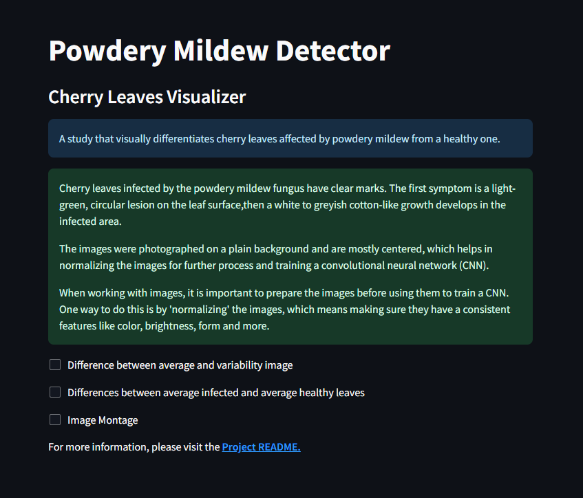
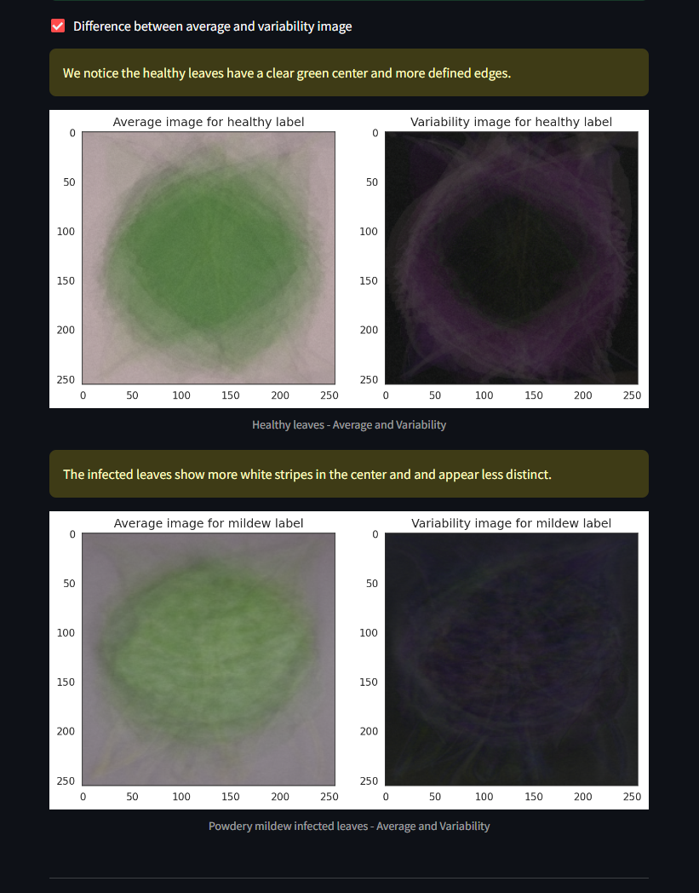
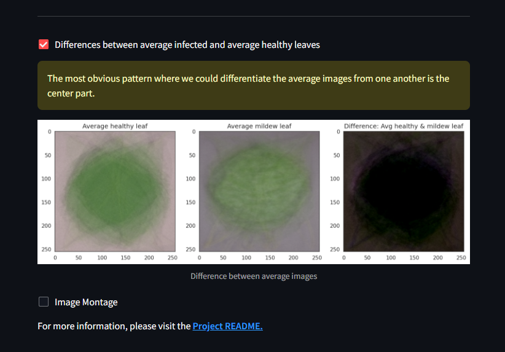
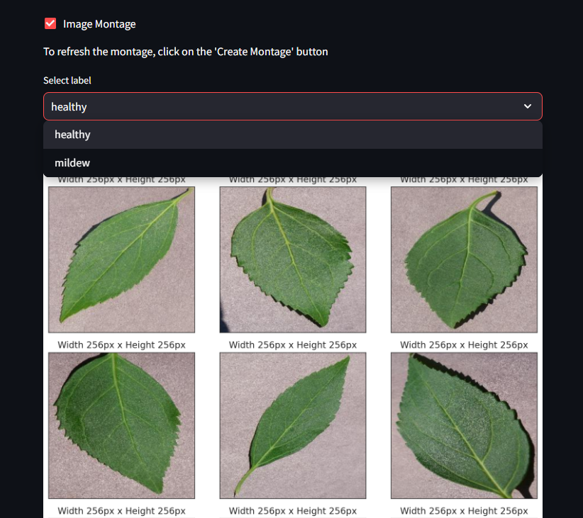

</details>

### Page 3 - Powdery Mildew Detector

Using an uploader widget, the client can upload a picture of a cherry leaf. The ML model will then detect if the leaf is infact infected with the powdery mildew fungus or healthy. Along with a bar plot, a report with the results can be downloaded. Awnsering business requirement 2.

<details>
<summary>Click Me to see the Powdery Mildew Detector Page</summary>

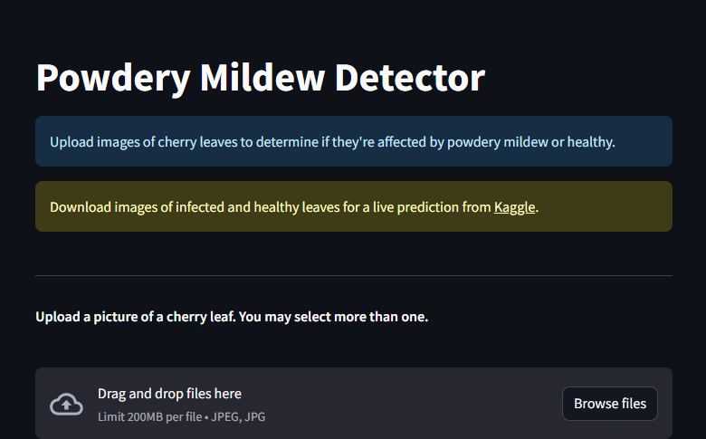
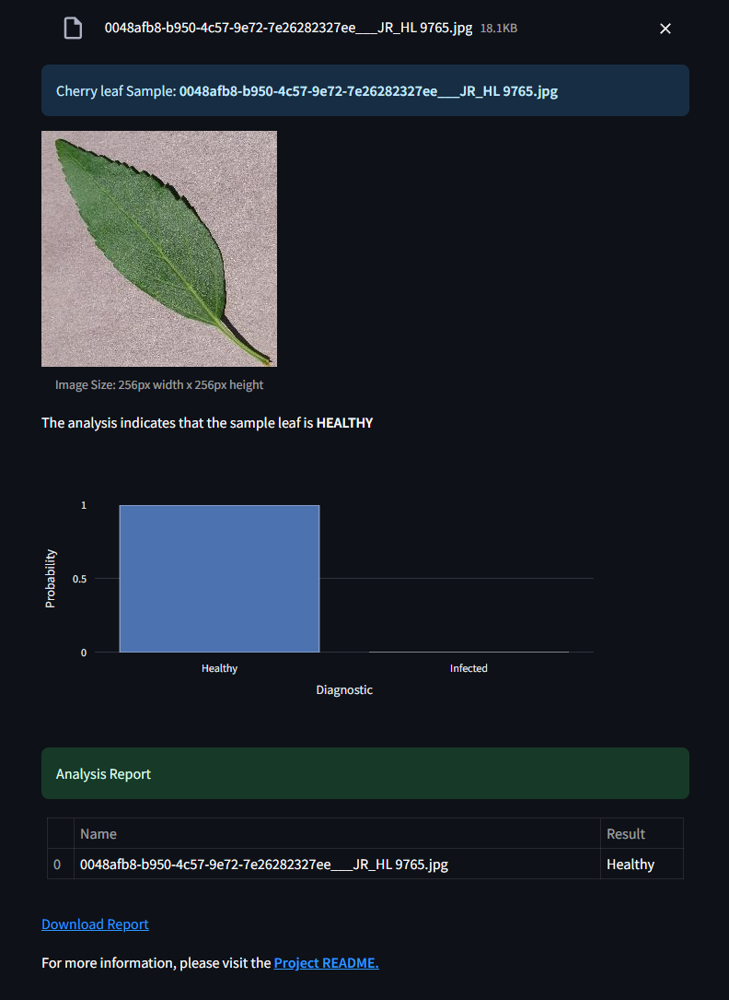

</details>

### Page 4 - Project Hypothesis

Displayed here is the projects hypothesis.

<details>
<summary>Click Me to see the Project Hypothesis Page</summary>

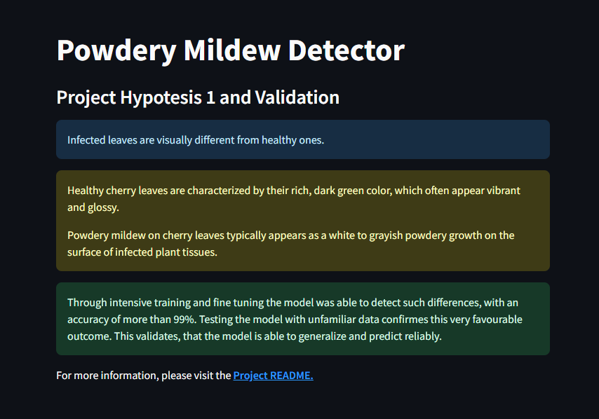

</details>

### Page 5 - ML Performance Metrics

In alignment with the client's requirements, as outlined in business requirement 4, this page includes performance metrics for the machine learning models. These metrics encompass dataset size, label frequencies, accuracy, and loss, supplemented by a confusion matrix showing the model's success.

<details>
<summary>Click Me to see the ML Performance Metrics Page</summary>


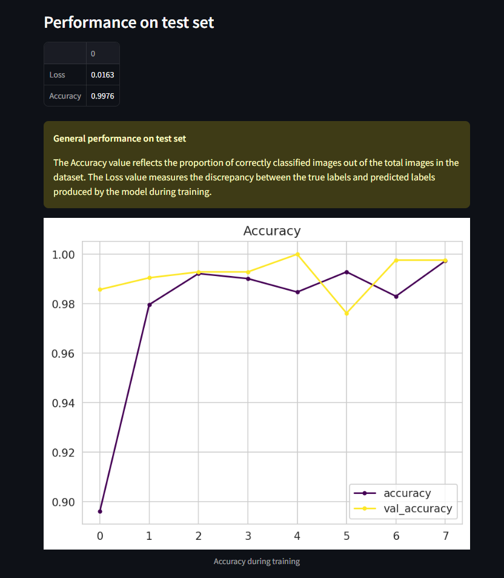

</details>  

[Back to top ⇧](#table-of-contents)

## **Bugs and Errors**

### ***Unfixed* Warning during production**

Warning during model training:

```
UserWarning: Your `PyDataset` class should call `super().__init__(**kwargs)` in its constructor. `**kwargs` can include `workers`, `use_multiprocessing`, `max_queue_size`. Do not pass these arguments to `fit()`, as they will be ignored. self._warn_if_super_not_called()
```

Although it's generally not advisable to disregard or suppress warnings, in this instance, the warning message suggests that certain arguments passed to the fit() method will be ignored. To mitigate this warning, a small code was implemented to suppress it:

```
def warn(*args, **kwargs):
    pass
import warnings
warnings.warn = warn
```

### **Unfixed Bugs an Errors**

In some cases the prediction of the Pwodery Mildew Detector turns out to be false. This could be due to various reasons:

+ Images with substantial background noise or poor focus may lead to inaccuracies in detection.
+ Reflections of light on the leaf's surface may be mistakenly identified as powdery mildew infection.

Potential fixes could be:
+ Implementing a function to isolate the leaf and maintain a uniform background color, reducing background noise.
+ Adjusting the contrast of images to enhance the visibility of features relevant to detection, thereby minimizing false positives. 

Example:
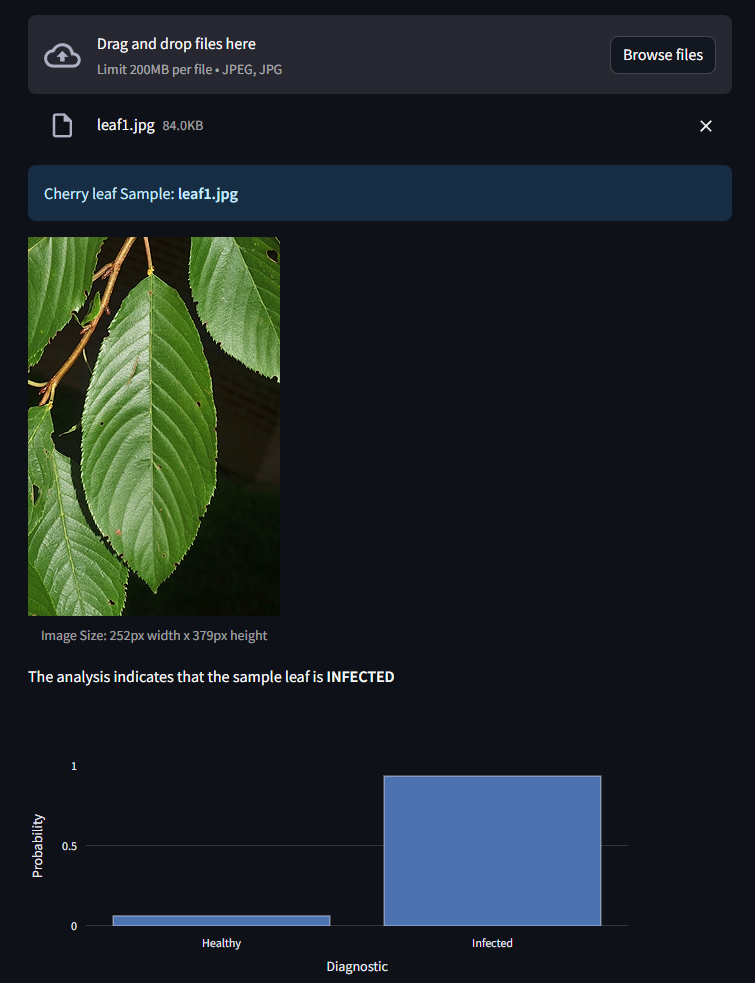

[Back to top ⇧](#table-of-contents)

## **Deployment**

### **Getting started**

The project was started by navigating to the [template](https://github.com/Code-Institute-Solutions/milestone-project-mildew-detection-in-cherry-leaves) provided and clicking 'Use this template'. Under Repository name I input "ml-mildew-detection-in-cherry-leaves" and checked the 'Include all branches' checkbox.

I am using [GitPod](https://www.gitpod.io/), and i am logged in with my "GitHub" credentials. After logging in, i navigated to the *Dashboard*, under *Workspaces* i selected *New Workspace*. I type in the repositories name and select *ml-mildew-detection-in-cherry-leaves* from the dropdown menu. In the second dropdown menu i select *VS Code ... Editor - Browser* to start the VS Code editor in my browser. After pressing *Continue* the workspace loads up and starts VS Code as expected. 

The following command were used in the terminal to ensure version control:

+ **git add filename** - This command was used to add files to the staging area before committing.
+ **git commit -m "commit message explaining the updates"** - This command was used to commit changes to the local repository.
+ **git reset HEAD^** - This command was used to delete the last commit but keep all the changes.
+ **git push** - This command is used to push all committed changes to the GitHub repository.

### **Forking the Repository**

By forking this repository, a copy of the repository is created in your GitHub account to view or make changes without affecting the original repository. For forking the repository follow these steps:

1. Locate the [Repository on GitHub](https://github.com/NixTS/ml-mildew-detection-in-cherry-leaves)
2. On the top right, click "Fork" and decide where to fork the repository.
3. The forked repository is now in your GitHub account and ready to view/change.

### **Making a local clone**

Cloning a repository creates a copy of the repository on your local machine. For cloning a repository follow these steps:

1. Locate the [Repository on GitHub](https://github.com/NixTS/ml-mildew-detection-in-cherry-leaves) and click the *Code* button on the top right.
2. Chose one of the available options: Clone with HTTPS, Open with Git Hub desktop, Download ZIP.
3. To clone the repository using HTTPS, under "Clone with HTTPS", copy the link.
4. Open your CLI application and chose the location where the repository should be located
5. Now type in
    ```
    > $ git clone https://github.com/NixTS/ml-mildew-detection-in-cherry-leaves.git
    ```
6. Press enter and wait for the repository to be cloned.

### **Creating the Heroku APP**

+ The App live link is: https://ml-powdery-mildew-detector-d12411e2b28f.herokuapp.com/
+ Set the runtime.txt Python version to a [Heroku-20](https://devcenter.heroku.com/articles/python-support#supported-runtimes) stack currently supported version.
+ The project was deployed to Heroku using the following steps:

1. Log in to Heroku and create an App
2. At the Deploy tab, select GitHub as the deployment method.
3. Select your repository name and click Search. Once it is found, click Connect.
4. Select the branch you want to deploy, then click Deploy Branch.
5. The deployment process should happen smoothly if all deployment files are fully functional. Click the button.
6. Open App on the top of the page to access your App.
7. If the slug size is too large, then add large files not required for the app to the .slugignore file.

[Back to top ⇧](#table-of-contents)
